<h1 align="center">The Cloud Bootcamp</h1>

<p align="center">
  
  


</p><p align="center">
  <a href="#-projeto">Projeto</a>&nbsp;&nbsp;&nbsp;|&nbsp;&nbsp;&nbsp;
  <a href="#-tecnologias">Tecnologias</a>&nbsp;&nbsp;&nbsp;|&nbsp;&nbsp;&nbsp;
  <a href="#-etapas">Etapas</a>&nbsp;&nbsp;&nbsp;|&nbsp;&nbsp;&nbsp;
  <a href="#-licença">Licença</a>&nbsp;&nbsp;&nbsp;|&nbsp;&nbsp;&nbsp;
  <a href="#-referências">Referências</a>
</p>

<p align="center">
  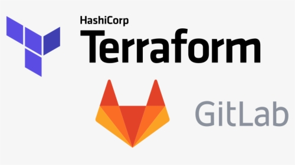
</p>

## 🌱 Projeto

No Projeto Cloud Implementação Compute, você fará o deploy do website niture usando um script. Mas ainda assim, você precisará logar via ssh no webserver e fazer a sua execução manualmente. Com isso, no Desafio Sheep HA, pense como consegue plugar esse script dentro da execução para que consiga fazer a automação de ponta a ponta. Pois,  com  todos os  casos de  lockdown, pandemia e  tudo  o  que  o  mundo está  vivendo,qualquer negócio que tenha o seu site ou a sua página indisponibilizada na internet estáperdendo dinheiro. Além disso, pense como implementar alta disponibilidade nessa camada, para garantir que sehouver um  problema com  o  webserver, você  tenha algum mecanismo  para  que  o  outro assuma e não tenha indisponibilidade no site da loja de móveis de luxo que está online a todo vapor.

<p align="center">
  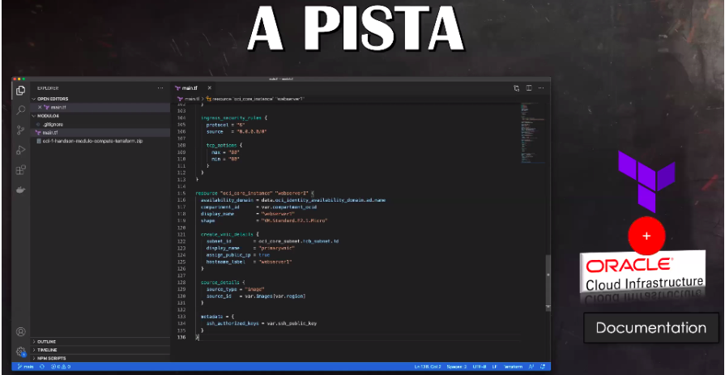
</p>

Fará uma utilização legal da pista do Desafio Sheep HA,  se  você  souber utilizar os  doiscomponentes indicados: Documentação do Terraform+  Documentação da  Oracle CloudInfrastructure. Além das documentações, existe uma solução que está praticamente prontaem um repositórioGithub perdido pela Internet. Portanto, se você for excelente durante apesquisa, o seu sucesso no Desafio Sheep HA está garantido.Preparado para iniciar? Com toda certeza, sim!Desejo sucesso no aprofundamento do seu conhecimento em Terraform + Github. Um excelentedesafio. Se lembre sempre: Para um Bootcamper, missão dada é missão cumprida. #pracima

## ✨ Tecnologias 

- Terraform
- OCI
- Telegram
- Gitlab-CI

## 🚀 Etapas

1. OCI

- Criação de usuário terraform

2. Terraform

- Estrutura do código

<p align="center">
  
</p>

- Variáveis para o acesso

```console
export TF_VAR_private_key=${private_key}
export TF_VAR_ssh_public_key=${ssh_public_key}
export TF_VAR_fingerprint=${fingerprint}
export TF_VAR_user_ocid=${user_ocid}
export TF_VAR_compartment_ocid=${compartment_ocid}
export TF_VAR_tenancy_ocid=${tenancy_ocid}
export TF_VAR_region=${region}
```
- Essa variábeis serão criadas dentro do gitlab

<p align="center">
  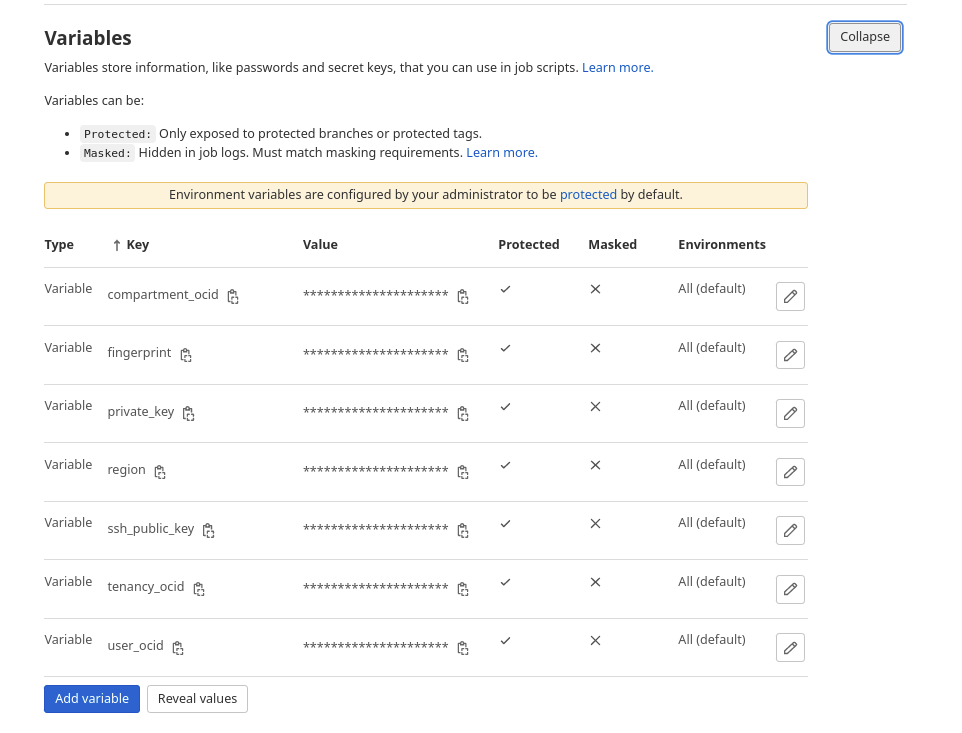
</p>

- Serão utilizadas dentro do arquivo `.gitlab-ci.yml`

<p align="center">
  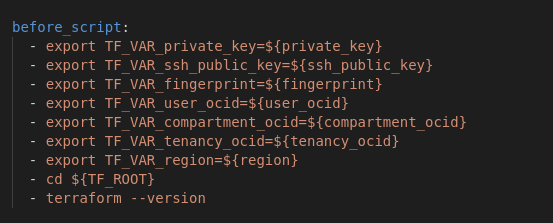
</p>

- Criação dos arquivos `.tf` para criar os seguintes recursos:
    - vcn
    - subnet
    - security list
    - route table
    - internet gateway
    - 2 instâncias
    - loadbbalancer
    - deploy do nitro

3. Gitlab

- Criação do arquivo `gitlab-ci.yml` com os stages:
  - prepare (`terraform init`)
  - validate (`terraform validate` e `terraform fmt`)
  - build (`terraform plan`)
  - deploy (`terraform apply`)
  - notificacao (Enviar `notificações` via `api do telegram` em casos de falha, sucesso e quando o ambiente for destruído)
  - cleanup (`terraform destroy`)

4. Telegram

- Criação do bot e um canal para envio das notificações.

## Execução

- Ao realizar um commit, um gatilho é disparado inicializando o pipeline.

<p align="center">
  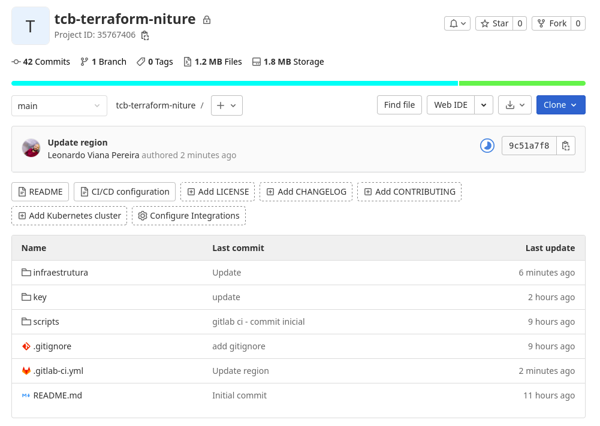
</p>

- Executando os stages definidos no arquivo `gitlab-ci.yml`, parando logo apos o stage `plan` ser executado, após isso será enviada uma notificação para o grupo no telegram, podemos fazer uma verificação do plan.

<p align="center">
  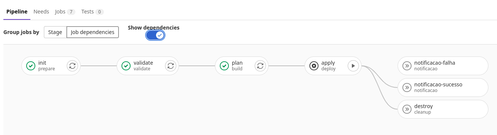
</p>

- Notificação no telegram

<p align="center">
  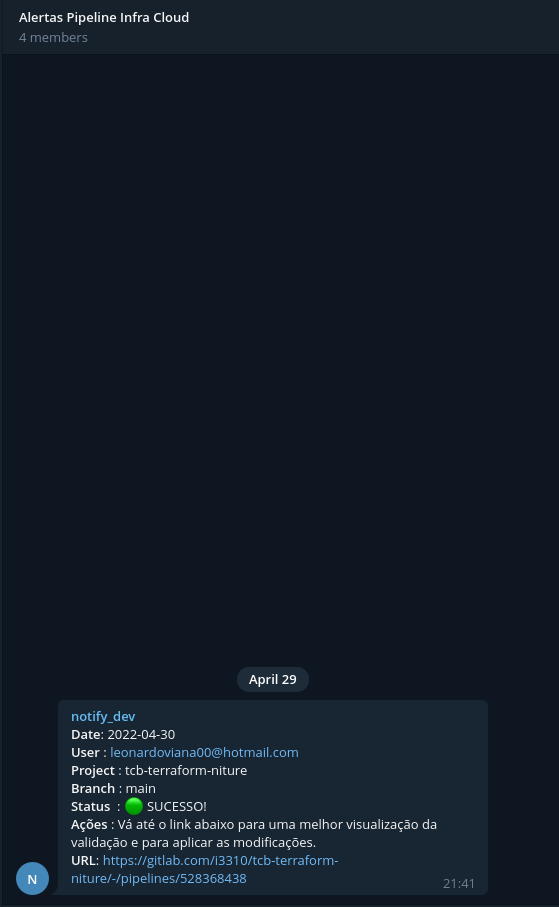
</p>

- Caso esteja tudo certo, disparamos o `apply` manualmente clicando no `play`.

<p align="center">
  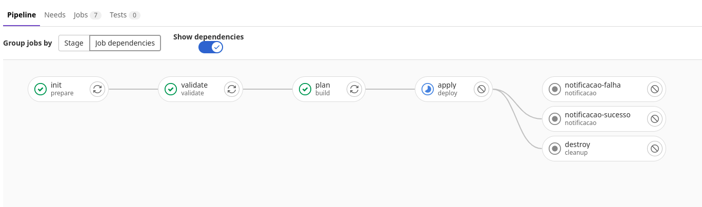
</p>

- Ao final do processo, receberemos o ip do `loadbalancer`.

<p align="center">
  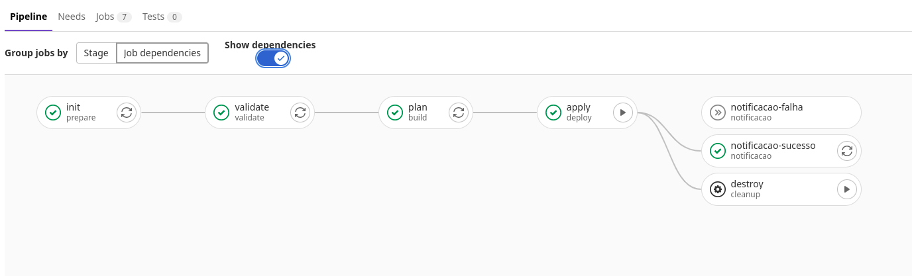
</p>

<p align="center">
  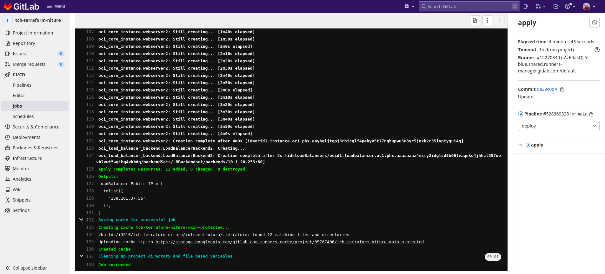
</p>

- Vamos fazer uma verificação na `OCI` para verificar se os recursos foram criados.

- Instâncias criadas

<p align="center">
  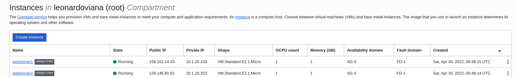
</p>

- Loadbalancer criado

<p align="center">
  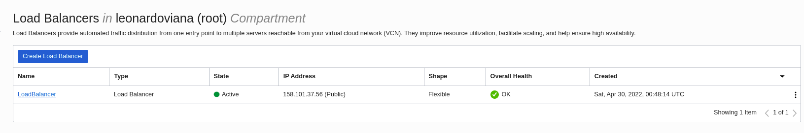
</p>

<p align="center">
  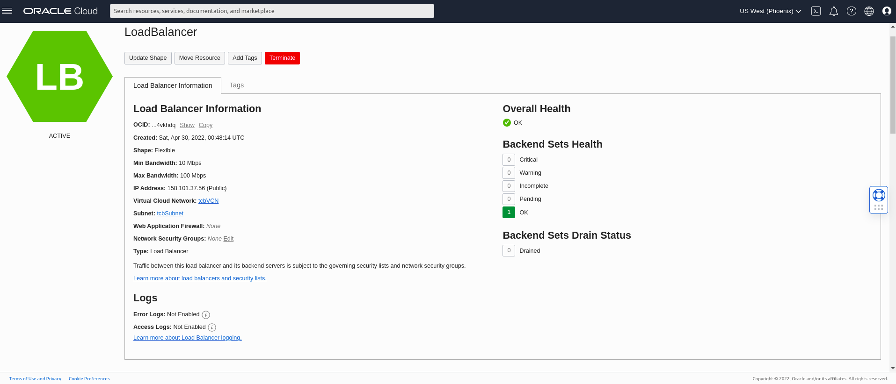
</p>

- Backends configurados

<p align="center">
  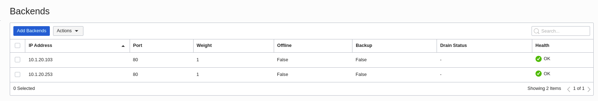
</p>

- Agora por fim, vamos verificar se conseguimos acessar o nitro através do ip do loadbalancer.

<p align="center">
  
</p>

- Pronto, dessa forma subimos uma infraestrutura na OCI e deployamos o site do nitro em duas instâncias onde temos um loadbalancer na frente delas fazendo o balanceamento das requisições, caso uma fique fora por algum motivo, o site não fica fora do ar por ter uma segunda instância. Agora que o lab foi finalizado, podemos destruir o ambiente.

<p align="center">
  
</p>

- Apos a finalização, uma notificação será enviada.

<p align="center">
  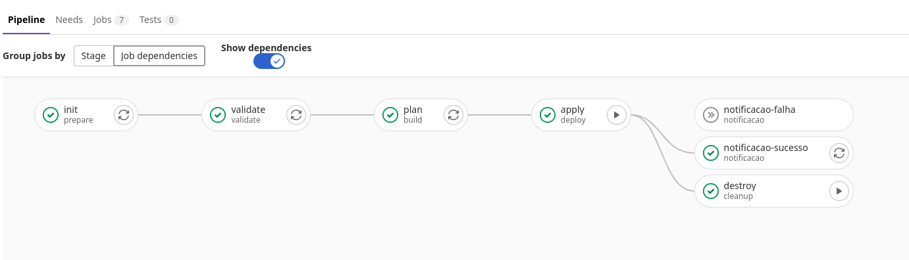
</p>

<p align="center">
  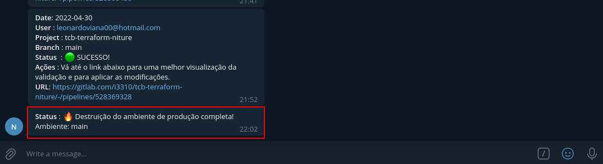
</p>


## 📄 Licença
Esse projeto está sob a licença MIT. Veja o arquivo [LICENSE](LICENSE) para mais detalhes.

## 🙇 Referências

- https://github.com/mlinxfeld/foggykitchen_tf_oci_course
- https://registry.terraform.io/providers/oracle/oci/latest/docs/resources/load_balancer_backend
- https://docs.oracle.com/en-us/iaas/Content/Balance/Concepts/balanceoverview.htm
- https://docs.gitlab.com/ee/ci/
- https://core.telegram.org/bots/api
